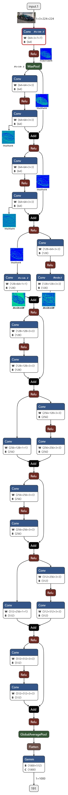

# Informe de ResNet 18

## Estudiantes (Practicas profesionalizantes de la E.E.S.T N°1 “Luciano Reyes”)

### Laurreaga Sebastián
### Martinelli Gonzalo

## Director
### Cerrotta Santiago - Grupo de Fotónica Aplicada FRD UTN

## 1. ¿Por qué llevamos a cabo este informe?

Para dar nuestros primeros pasos en redes neuronales convolucionales, decidimos entender el funcionamiento, la arquitectura, los pesos y los feature maps de una de las RNC precursoras, fue así como nos adentramos en la arquitectura de ResNet y nos cautivó su funcionamiento como para dedicarle un informe detallado.

## 2. Introducción

### ¿En qué contexto surge la Resnet y cuál fue su gran aporte?

La CNN que empezó con este avance fue AlexNet que redujo la tasa del Top-5 de ImageNet dejándola en 15.3% en el año 2012. Debido a esto se empezaron a crear arquitecturas que incluyen muchas capas, esto hacía que se perdiera información de los features maps, a esto se lo denominó “problema de desvanecimiento de gradiente”. Debido a esto en al año 2015 surgió una CNN llamada ResNet, que implementó la función de identidad usando el residuo de los feature maps así solucionando el problema anteriormente mencionado.

- “When deeper networks are able to start converging, a degradation problem has been exposed: with increasing depth, accuracy saturates and then degrades rapidly, and surprisingly this is not caused by overfitting.” - Cita del paper oficial de ResNet[1].

- “Cuando las redes más profundas logran converger, aparece un problema de degradación: al aumentar la profundidad, la precisión se satura y luego disminuye rápidamente, y sorprendentemente esto no se debe al sobreajuste.” - Traducción al español de la cita.

### ¿Qué ResNet se utilizará?

<a href="https://openaccess.thecvf.com/content_cvpr_2016/papers/He_Deep_Residual_Learning_CVPR_2016_paper.pdf" target="_blank">ResNet18:</a> Propuesta por Kaiming He, Xiangyu Zhang, Shaoqing Ren y Jian Sun en 2015. ResNet 18 es una de las variantes más pequeñas y populares.

## Innovaciones clave:

### - Bloques Residuales:
ResNet introduce los bloques residuales: esto significa que cada bloque aprende solo el residuo (F(x)) necesario para transformar la entrada (x) en la salida deseada (H(x)). La conexión de salto combina x + F(x), preservando información base y permitiendo entrenar redes extremadamente profundas sin degradación.

- “We address the degradation problem by introducing a residual learning framework, where instead of making stacked layers approximate the desired function H(x), we let them approximate the residual function F(x) = H(x) − x, reformulating the mapping as F(x) + x.” - Cita del paper oficial de ResNet[1].
	
- “Abordamos el problema de degradación introduciendo un marco de aprendizaje residual, donde en lugar de que las capas apiladas se ajusten directamente a la función deseada H(x), las dejamos aproximar la función residual F(x) = H(x) − x, reformulando el mapeo como F(x) + x.” - Traducción al español de la cita.

### - Solución al Problema de Degradación: 
Las redes neuronales profundas a menudo sufren un problema de "degradación", donde la precisión de entrenamiento comienza a disminuir después de un cierto punto a medida que se agregan más capas. ResNet abordó este problema al permitir que las capas adicionales aprendan la función identidad, lo que significa que agregar más capas no debería empeorar el rendimiento.

- “The shortcut connections perform identity mapping, and their outputs are added to the outputs of stacked layers; these identity shortcuts introduce neither extra parameters nor additional computational complexity.” - Cita del paper oficial de ResNet[1].

- “Las conexiones de omisión realizan un mapeo de identidad, y sus salidas se suman a las de las capas apiladas; estas conexiones identidad no introducen parámetros extra ni complejidad computacional adicional.” - Traducción al español de la cita.

## Arquitectura de ResNet18
A continuación se realizará una breve descripción con las características principales de los elementos que se encuentran presentes en la arquitectura de la ResNet18.

### Bloque Inicial:

- *Input:* Imagen RGB (3 canales, ej: 224x224 píxeles).
- *7x7 conv, 64, stride 2*  (reduce tamaño espacial a la mitad: ej: 224x224 → 112x112)*:*
  - *Capa convolucional:* Filtros 7x7 que extraen características básicas (bordes, texturas).
  - *Salida:* 64 mapas de características (como "fotocopias mejoradas" de la imagen original).
- Maxpool, stride 2.

### Bloques Residuales:

Cada grupo de 2 capas forma un bloque residual. Las flechas de *"atajo"* (↙) suman la entrada directa a la salida:

[Entrada] → 3x3 conv → ReLU → 3x3 conv → [+] → Salida  

`      `⇘\_\_\_\_\_\_\_\_\_\_\_\_\_\_\_\_\_\_\_\_\_\_\_\_\_\_\_\_\_\_\_\_\_\_⇗  (Conexión residual) 

- *Bloque 1 (64 canales):*
  - 3x3 conv, 64 → 3x3 conv, 64 → Suma con entrada.
  - (Se repite 2 veces más).

- *Bloque 2 (128 canales, /2 = downsample (logrado con el stride 2)):*
  - 3x3 conv, 128, stride 2.
  - 3x3 conv, 128 → Suma con entrada adaptada al nuevo tamaño del feature map).

- *Bloque 3 (256 canales, /2):*
  - Mismo patrón: Reducción del tamaño espacial más aprendizaje residual.

- *Bloque 4 (512 canales, /2):*
  - Capa final con mayor profundidad de características (patrones complejos como formas globales).

### Capas Finales:

- ***Avg pool***: *Global Average Pooling*:
  - Reduce cada mapa de características 512x7x7 → 512x1x1 (promedia todos los píxeles).
  - Ventaja: Elimina necesidad de capas FC enormes (como en AlexNet).
- **FC**: *Capa totalmente conectada*:
  - Convierte las 512 características en scores para cada clase (ej: 1000 clases en ImageNet).
- **Softmax**: 
  - Convierte scores en probabilidades (ej: "90% perro, 5% gato").

## Esquema
En la figura(1) se muestra el esquema de ResNet18 que incluye parte de su arquitectura, sus conexiones y en donde se pueden visualizar los features maps en los primeros 4 bloques para ayudar a comprender su funcionamiento. En especial, para entender la forma del Residuo.

	

	 
<em> Figura 1 - Arquitectura de ResNet18 con imagenes del proceso de su feature map </em>

En el gráfico (Figura 2), se visualiza la estrategia de Resnet para preservar la información de capas anteriores. Al feature map de la capa anterior se le suma nuevos detalles o residuos detectados en el nuevo bloque F(x). El feature map de salida de la capa residual es la suma de las anteriores. En el esquema de la arquitectura se menciona como una capa de suma “Add”  aplicando a continuación una capa ReLU de ResNet.

	

	 
<em> Figura 2 - Suma residual de los feature map en ResNet </em>

En la comparativa (Figura 3) se demuestra la igualdad entre el resultado que obtuvimos sumando los feature map manualmente y aplicando el ReLU predeterminado (el usado por ResNet) y concluímos en que los resultados son exactamente idénticos, en la barra de colores se muestra el valor de activación de ciertas partes del feature map (también se comprobó en el código si son iguales con el comando torch.allclose() ).

	

	 
<em> Figura 3 - Comparativa de la suma manual con el ADD de ResNet (Con ReLU aplicado) </em>

## Summary

aquí se muestra como ResNet18 maneja sus parámetros, como los calcula y tambien se muestra el tamaño de salida de los feauture maps.

|Layer (type)|Output Shape|Cálculos|Parámetros |
| :- | :- | :- | :- |
|Conv2d-1|[-1, 64, 112, 112]|64 \* 3 \* 7 \* 7|9,408|
|BatchNorm2d-2|[-1, 64, 112, 112]|` `64 \* 2|128|
|ReLU-3|[-1, 64, 112, 112] |-|0|
|MaxPool2d-4|[-1, 64, 56, 56]|-|0|
|Conv2d-5|[-1, 64, 56, 56]|64 \* 64 \* 3 \* 3|36,864|
|BatchNorm2d-6|[-1, 64, 56, 56]|64 \* 2|128|
|ReLU-7|[-1, 64, 56, 56]|-|0|
|Conv2d-8|[-1, 64, 56, 56]|64 \* 64 \* 3 \* 3|36,864|
|BatchNorm2d-9|[-1, 64, 56, 56]|64 \* 2|128|
|ReLU-10|[-1, 64, 56, 56]|-|0|
|BasicBlock-11|[-1, 64, 56, 56]|-|0|
|Conv2d-12|[-1, 64, 56, 56]|64 \* 64 \* 3 \* 3|36,864|
|BatchNorm2d-13|[-1, 64, 56, 56]|64 \* 2 |128|
|ReLU-14|[-1, 64, 56, 56]|-|0|
|Conv2d-15|[-1, 64, 56, 56]|64 \* 64 \* 3 \* 3|36,864|
|BatchNorm2d-16|[-1, 64, 56, 56]|64 \* 2|128|
|ReLU-17|[-1, 64, 56, 56]|-|0|
|BasicBlock-18|[-1, 64, 56, 56]|-|0|
|Conv2d-19|[-1, 128, 28, 28]|128 \* 64 \* 3 \* 3|73,728|
|BatchNorm2d-20|[-1, 128, 28, 28]|128 \* 2|256|
|ReLU-21|[-1, 128, 28, 28]|-|0|
|Conv2d-22|[-1, 128, 28, 28]|128 \* 128 \* 3 \* 3|147,456|
|BatchNorm2d-23|[-1, 128, 28, 28]|128 \* 2|256|
|Conv2d-24|[-1, 128, 28, 28]|128 \* 64 \* 1 \* 1|8,192|
|BatchNorm2d-25|[-1, 128, 28, 28]|128 \* 2|256|
|ReLU-26|[-1, 128, 28, 28]|-|0|
|BasicBlock-27|[-1, 128, 28, 28]|-|0|
|Conv2d-28|[-1, 128, 28, 28]|128 \* 128 \* 3 \* 3|147,456|
|BatchNorm2d-29|[-1, 128, 28, 28]|128 \* 2|256|
|ReLU-30|[-1, 128, 28, 28]|-|0|
|Conv2d-31|[-1, 128, 28, 28]|128 \* 128 \* 3 \* 3|147,456|
|BatchNorm2d-32|[-1, 128, 28, 28]|128 \* 2|256|
|ReLU-33|[-1, 128, 28, 28]|-|0|
|BasicBlock-34|[-1, 128, 28, 28]|-|0|
|Conv2d-35|[-1, 256, 14, 14]|256 \* 128 \* 3 \* 3|294,912|
|BatchNorm2d-36|[-1, 256, 14, 14]|256 \* 2|512|
|ReLU-37|[-1, 256, 14, 14]|-|0|
|Conv2d-38|[-1, 256, 14, 14]|256 \* 256 \* 3 \* 3|589,824|
|BatchNorm2d-39|[-1, 256, 14, 14]|256 \* 2|512|
|Conv2d-40|[-1, 256, 14, 14]|256 \* 128 \* 1 \* 1|32,768|
|BatchNorm2d-41|[-1, 256, 14, 14]|256 \* 2|512|
|ReLU-42|[-1, 256, 14, 14]|-|0|
|BasicBlock-43|[-1, 256, 14, 14]|-|0|
|Conv2d-44|[-1, 256, 14, 14]|256 \* 256 \* 3 \* 3|589,824|
|BatchNorm2d-45|[-1, 256, 14, 14]|256 \* 2|512|
|ReLU-46|[-1, 256, 14, 14]|-|0|
|Conv2d-47|[-1, 256, 14, 14]|256 \* 256 \* 3 \* 3|589,824|
|BatchNorm2d-48|[-1, 256, 14, 14]|256 \* 2|512|
|ReLU-49|[-1, 256, 14, 14]|-|0|
|BasicBlock-50|[-1, 256, 14, 14]|-|0|
|Conv2d-51|[-1, 512, 7, 7]|512 \* 256 \* 3 \* 3|1,179,648|
|BatchNorm2d-52|[-1, 512, 7, 7]|512 \* 2|1,024|
|ReLU-53|[-1, 512, 7, 7]|-|0|
|Conv2d-54|[-1, 512, 7, 7]|512 \* 512 \* 3 \* 3|2,359,296|
|BatchNorm2d-55|[-1, 512, 7, 7]|512 \* 2|1,024|
|Conv2d-56|[-1, 512, 7, 7]|512 \* 256 \* 1 \* 1|131,072|
|BatchNorm2d-57|[-1, 512, 7, 7]|512 \* 2|1,024|
|ReLU-58|[-1, 512, 7, 7]|-|0|
|BasicBlock-59|[-1, 512, 7, 7]|-|0|
|Conv2d-60|[-1, 512, 7, 7]|512 \* 512 \* 3 \* 3|2,359,296|
|BatchNorm2d-61|[-1, 512, 7, 7]|512 \* 2|1,024|
|ReLU-62|[-1, 512, 7, 7]|-|0|
|Conv2d-63|[-1, 512, 7, 7]|512 \* 512 \* 3 \* 3|2,359,296|
|BatchNorm2d-64|[-1, 512, 7, 7]|512 \* 2|1,024|
|ReLU-65|[-1, 512, 7, 7]|-|0|
|BasicBlock-66|[-1, 512, 7, 7]|-|0|
|AdaptiveAvgPool2d-67|[-1, 512, 1, 1]|-|0|
|Linear-68|[-1, 1000]|512 \* 1000 + 1000|513,000|
|Total params|11,689,512|||

## Conclusión

Comprender el funcionamiento de la ResNet nos permitió desarrollar un entendimiento general sobre redes neuronales convolucionales. Entendimos cómo funcionan los filtros, la cantidad de pesos asociadas a cada capa, como acceder a sus mapas de características, problemáticas asociadas a este tipo de redes como el degradamiento y los objetivos de cada bloque o capa dentro de la arquitectura.

### Fuentes

[[1.] He, K., Zhang, X., Ren, S., & Sun, J. (2016). Deep residual learning for image recognition. In Proceedings of the IEEE conference on computer vision and pattern recognition (pp. 770-778).](https://openaccess.thecvf.com/content_cvpr_2016/papers/He_Deep_Residual_Learning_CVPR_2016_paper.pdf)

[[2.] ResNet — Understand and Implement from scratch](https://medium.com/analytics-vidhya/resnet-understand-and-implement-from-scratch-d0eb9725e0db#id_token=eyJhbGciOiJSUzI1NiIsImtpZCI6IjhlOGZjOGU1NTZmN2E3NmQwOGQzNTgyOWQ2ZjkwYWUyZTEyY2ZkMGQiLCJ0eXAiOiJKV1QifQ.eyJpc3MiOiJodHRwczovL2FjY291bnRzLmdvb2dsZS5jb20iLCJhenAiOiIyMTYyOTYwMzU4MzQtazFrNnFlMDYwczJ0cDJhMmphbTRsamRjbXMwMHN0dGcuYXBwcy5nb29nbGV1c2VyY29udGVudC5jb20iLCJhdWQiOiIyMTYyOTYwMzU4MzQtazFrNnFlMDYwczJ0cDJhMmphbTRsamRjbXMwMHN0dGcuYXBwcy5nb29nbGV1c2VyY29udGVudC5jb20iLCJzdWIiOiIxMDcwMzEyMjc5NTgwODQxMTI2MjUiLCJlbWFpbCI6InNlYmFzdGlhbmxhdXJyZWFnYUBnbWFpbC5jb20iLCJlbWFpbF92ZXJpZmllZCI6dHJ1ZSwibmJmIjoxNzUxNjQ4NDgzLCJuYW1lIjoiU2ViYXN0aWFuIExhdXJyZWFnYSIsInBpY3R1cmUiOiJodHRwczovL2xoMy5nb29nbGV1c2VyY29udGVudC5jb20vYS9BQ2c4b2NLYnZUSHQ1S2s5RGVqVlZIRk5GZFkzMjE4a0VzeEo0cjJKMHFrelVpcDBURW01cnlOOD1zOTYtYyIsImdpdmVuX25hbWUiOiJTZWJhc3RpYW4iLCJmYW1pbHlfbmFtZSI6IkxhdXJyZWFnYSIsImlhdCI6MTc1MTY0ODc4MywiZXhwIjoxNzUxNjUyMzgzLCJqdGkiOiI3ZGVmYWRmZWRiMzJiZDdmNTg4MDA0ZTdiZWI3OWMzYmU2MjUxMDVhIn0.G09ZohsKmhJOC0xNK040h1O8jMOoZ3PO252CX4WOOVJs6OlNC_phu_aSi-ByciW3lXbhuQ4KbFgg5nuGuXZ3sy4dhSJHd3d4dJ0L0SJ0AqPVwtwo6iptgpJKoXgEexGutPQ9I7zjQxvjXeevZx2iDfFoTWMAIJ9_UgGSVn4F_7ten-qVNQvaUY_E71Svrh36YlpyAfeq_7Ca_78IjpIg9YPNAZQmbAMlPx0FFaNPWUNtkCnVisoiqHiIOlcAFTh6hIXAU7HWRh8dHmSeLcL7HCmgyPeTybiF6qrXx01sIc8xLiFJ60RrbykQ7ErlJGqUM03jTA4cQ_usJadl7pY8_w)
